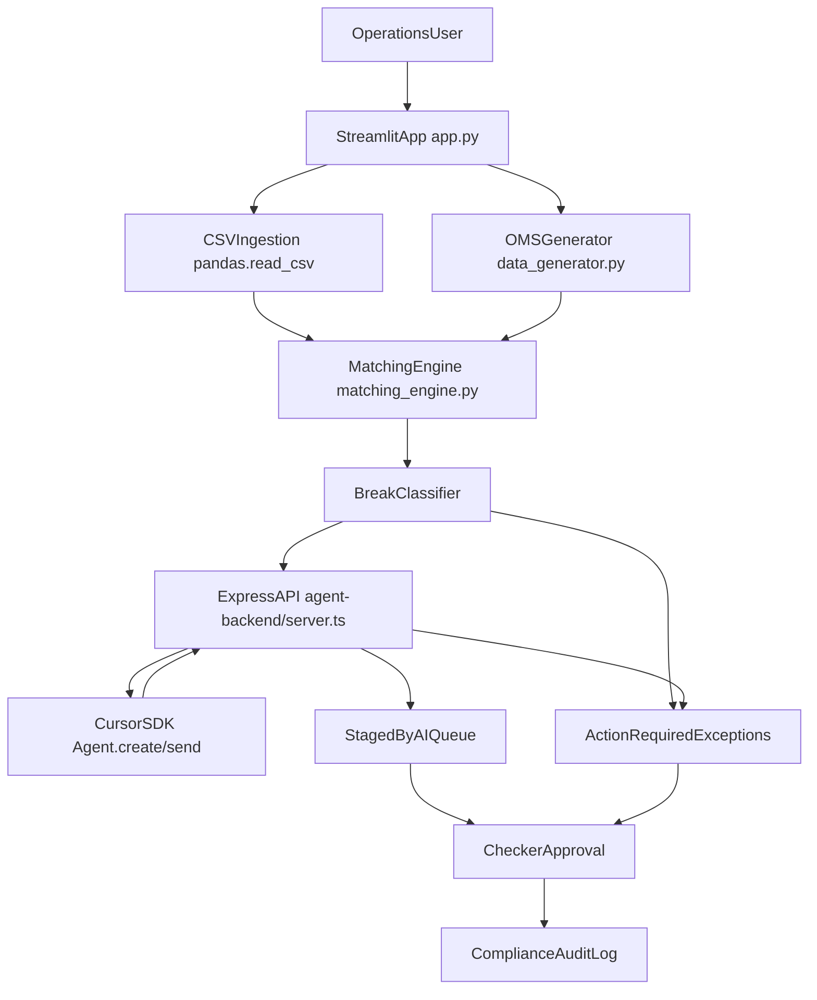

# Hawkeye System Architecture

## Overview

Hawkeye is a two-tier system:

- A Streamlit front-end (`app.py`) for ingestion, triage, checker actions, and audit visibility.
- A TypeScript Express backend (`agent-backend/server.ts`) that orchestrates Cursor Agent reasoning.

The reconciliation engine (`matching_engine.py`) and sample data generator (`data_generator.py`) provide deterministic data processing.

## Component Diagram



## Runtime Data Flow

1. **Ingest**  
   User uploads PB CSV in sidebar (`Prime Broker Statement (CSV)`).

2. **Normalize + Reconcile**  
   - PB data read via `pd.read_csv`.
   - OMS data simulated via `generate_trade_data()`.
   - `reconcile_trades(oms_df, pb_df)` returns:
     - `perfect_matches`
     - `unmatched`
     - `mismatched`

3. **Build Exception Set**  
   UI merges unmatched + mismatched into a unified break set.

4. **Autonomous Agent Trigger**  
   On new file signature (`name`, `size`), app auto-calls backend once per upload.

5. **Policy Decisioning**  
   Backend prompt applies hedge-fund policies and returns strict JSON:
   - `status` (`staged_for_approval` | `escalated`)
   - `policy_cited`
   - `audit_rationale`
   - `drafted_email` (when escalated)

6. **Routing**
   - `staged_for_approval` -> `Staged by AI (Pending Approval)`
   - `escalated` -> `Action Required (Exceptions)`

7. **Human Checker + Commit**
   Checker edits selected staged metadata and commits batch to audit log.

8. **Audit**
   Compliance log records final checker-approved actions with timestamp and approver.

## State Management

Streamlit `session_state` keys:

- `ai_break_results` - per-break AI decision payload
- `last_ingested_signature` - latest uploaded file signature for ingestion toast semantics
- `last_autorun_signature` - prevents duplicate autonomous runs per file
- `committed_staged_break_ids` - tracks breaks committed to audit
- `approved_email_break_ids` - tracks escalated items acknowledged by checker
- `compliance_audit_log` - append-only audit entries shown in UI

## External Interfaces

### Front-end to Backend

- **Method**: `POST`
- **URL**: `http://localhost:3001/resolve-break`
- **Request body**:

```json
{
  "breakDetails": {
    "TradeDate": "2026-04-30",
    "Ticker": "AAPL",
    "Side": "Buy",
    "Quantity": 2000,
    "Price": 192.34,
    "Commission": 19.25,
    "Broker": "MS"
  }
}
```

- **Response body**:

```json
{
  "status": "staged_for_approval",
  "policy_cited": "Rule PB-01",
  "audit_rationale": "Commission delta is below threshold and within policy tolerance."
}
```

## Operational Notes

- Backend requires `CURSOR_API_KEY`.
- Streamlit requires `streamlit`, `pandas`, `requests`.
- Backend requires Node deps and runtime (`tsx` for direct TypeScript run).
